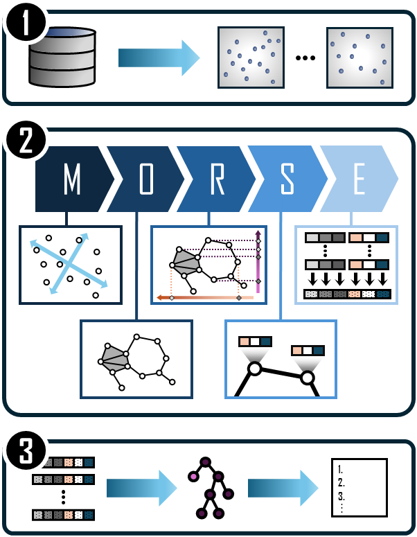

# Leveraging Morse Theory and Machine Learning for Computer-Aided Drug Discovery
<p align="center">
  
</p>

This repository contains the underlying code for the preprint
> Tanaka, A. M., Asaad, A. T., Cooper, R. I., & Nanda, V. (2025).
> A Morse Transform for Drug Discovery. arXiv e-prints, [arXiv:2503.04507](https://arxiv.org/abs/2503.04507).


## Reference platform
This code was developed and tested on the following operating systems:

- CentOS Linux 8 (Core) and AlmaLinux 9

The code is likely, but not guaranteed, to be compatible with any RHEL 8- or 9-based Linux distribution. Compatability with macOS or Windows (WSL 2 is recommended) is unverified and unsupported. 


## Software prerequisites
- [Git](https://git-scm.com/book/en/v2/Getting-Started-Installing-Git) (version control)
- [Conda](https://docs.conda.io/projects/conda/en/latest/user-guide/install/index.html) (environment management)

Please note that the commands in this repository are written for a Linux-based terminal.


## Getting started
1. Clone the repository:
    ```
    git clone https://github.com/alex-tanaka/morse-transform-for-drug-discovery.git
    cd morse-transform-for-drug-discovery
    ```

2. Create the Conda environment from the `environment.yml` file and activate it.

    ```
    conda env create -f environment.yml
    conda activate morse_cadd_env
    ```

3. Launch the Jupyter Notebook tutorials and select the `morse_cadd_env` environment as the kernel.


## Tutorials
The tutorials are in the form of Jupyter Notebooks and can be found in the `notebooks` directory:

- Notebook I: Morse Feature Generation Walkthrough

- Notebook II: Batch Morse Feature Generation

- Notebook III: Classifying Morse Features

View the notebooks on [nbviewer](https://nbviewer.org/github/alex-tanaka/morse-transform-for-drug-discovery/tree/main/notebooks/) for interactive plots.

## Pipeline
<p align="center">
  
</p>

A diagrammatic overview of our virtual screening pipeline:

1. _Data preparation_. We generate molecular point clouds from the virtual screening datasets DUD-E and MUV. 

2. _Feature generation_. We compute our topological feature vector in five steps (**MORSE**): 

    - **M**odify the point cloud by mean-centring and aligning with its principal component axes; 

    - **O**btain the simplicial complex representation of the molecule; 

    - **R**ealise the Morse transform of the molecular simplicial complex over multiple directions; 

    - **S**upplement the output of the Morse transform with atomic chemical properties; 

    - **E**ncapsulate the chemistry-supplemented output in a Morse feature vector. 

3. _Classification_. We train a LightGBM gradient-boosted decision tree on Morse feature vectors to perform a binary classification task to rank molecules on how likely they are to bind to specific protein targets.


## Citation
If you made use of this repository during your research, then please cite the following preprint
```
@misc{morsetransformdrugdiscovery2025,
      title={A Morse Transform for Drug Discovery}, 
      author={Alexander M. Tanaka and Aras T. Asaad and Richard Cooper and Vidit Nanda},
      year={2025},
      eprint={2503.04507},
      archivePrefix={arXiv},
      primaryClass={q-bio.QM},
      url={https://arxiv.org/abs/2503.04507}, 
}
```

